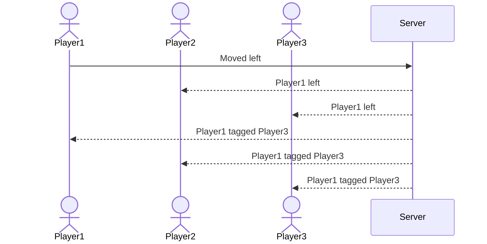

# Tag

[My Notes](notes.md)

Tag. It's tag. It'll be a real time online multiplayer version of the classic playground game. There's a lot of potential features to be added here, such as powerups, maps, custom skins, and all the like. Down the road, we'll see just which features get added, but the core gameplay loop will be the eternal game of tag.

## 🚀 Specification Deliverable

For this deliverable I did the following. I checked the box `[x]` and added a description for things I completed.

- [x] Proper use of Markdown: I looked up markdown syntax and made sure to follow proper conventions
- [x] A concise and compelling elevator pitch: I made the pitch (see below)
- [x] Description of key features: I listed some key features I'd like for now. Subject to change depending on how things go.
- [x] Description of how you will use each technology: I described what each technology is for.
- [x] One or more rough sketches of your application. Images must be embedded in this file using Markdown image references: I included sketches of each HTML page as well as a sequence diagram showing the communication that happens when someone is tagged.

### Elevator pitch

Did you play tag on the playground? Why does such a basic game have so much appeal? Whatever the reason, tag was fun as a kid, and it can still be fun even when your friends are farther away than they used to be. Imagine the chaos of a real time online multiplayer game of tag enhanced by powerups, custom art, and more. A simple game to pull friends together to chat, laugh, and maybe cause a little mamyhem along the way. Are you ready to play?

### Design

This is the login/create account screen. This will be the default page when the server is first hit.

After logging in, the user will be sent here. This screen shows gameplay statistics and customization options. Here is also where the user can create and join games.

This is the main gameplay screen. In the middle is the actual game. On the left is a screen showing the other players in the room, and on the right shows the user and their stats for the round.

The server will act as the brain of the game. It will keep track of player locations and when someone is tagged.

### Key features

- Real time online multiplayer
- Individual player statistics are recorded
- Player skins are customizable
- Rooms can be created and joined by players so friends can play together
- Obstacles and powerups make rounds diverse

### Technologies

I am going to use the required technologies in the following ways.

- **HTML** - Frameworking the pages. There will be three pages: the login/create account page, the profile page, and the game page. Hyperlinks will allow users to navigate from page to page. The game screen will be drawn with a `<canvas>`
- **CSS** - Style the pages to be consistent with each other and look appealing. This will mainly be a desktop/tablet application, so things may not look right on mobile.
- **React** - Update the game screen, pull up modals for creating/joining games, update the statistics to track them live, etc...
- **Service** - Backend endpoints for:
    - Create account
    - Login
    - Update profile (change skin, name, etc...)
    - Create a game
    - Join a game
    - Game actions (moving, being tagged, etc...)
    - Exit a game (intentionally or because of crash or disconnection)
- **DB/Login** - Storing profile preferences and statistics and login credentials. The user can't join or create a game without being authenticated.
- **WebSocket** - Movements, tags, pickups, etc... will be broadcasted by the server to all players so that they can play simultaneously.

## 🚀 AWS deliverable

For this deliverable I did the following. I checked the box `[x]` and added a description for things I completed.

- [ ] **Server deployed and accessible with custom domain name** - [My server link](https://yourdomainnamehere.click).

## 🚀 HTML deliverable

For this deliverable I did the following. I checked the box `[x]` and added a description for things I completed.

- [ ] **HTML pages** - I did not complete this part of the deliverable.
- [ ] **Proper HTML element usage** - I did not complete this part of the deliverable.
- [ ] **Links** - I did not complete this part of the deliverable.
- [ ] **Text** - I did not complete this part of the deliverable.
- [ ] **3rd party API placeholder** - I did not complete this part of the deliverable.
- [ ] **Images** - I did not complete this part of the deliverable.
- [ ] **Login placeholder** - I did not complete this part of the deliverable.
- [ ] **DB data placeholder** - I did not complete this part of the deliverable.
- [ ] **WebSocket placeholder** - I did not complete this part of the deliverable.

## 🚀 CSS deliverable

For this deliverable I did the following. I checked the box `[x]` and added a description for things I completed.

- [ ] **Visually appealing colors and layout. No overflowing elements.** - I did not complete this part of the deliverable.
- [ ] **Use of a CSS framework** - I did not complete this part of the deliverable.
- [ ] **All visual elements styled using CSS** - I did not complete this part of the deliverable.
- [ ] **Responsive to window resizing using flexbox and/or grid display** - I did not complete this part of the deliverable.
- [ ] **Use of a imported font** - I did not complete this part of the deliverable.
- [ ] **Use of different types of selectors including element, class, ID, and pseudo selectors** - I did not complete this part of the deliverable.

## 🚀 React part 1: Routing deliverable

For this deliverable I did the following. I checked the box `[x]` and added a description for things I completed.

- [ ] **Bundled using Vite** - I did not complete this part of the deliverable.
- [ ] **Components** - I did not complete this part of the deliverable.
- [ ] **Router** - I did not complete this part of the deliverable.

## 🚀 React part 2: Reactivity deliverable

For this deliverable I did the following. I checked the box `[x]` and added a description for things I completed.

- [ ] **All functionality implemented or mocked out** - I did not complete this part of the deliverable.
- [ ] **Hooks** - I did not complete this part of the deliverable.

## 🚀 Service deliverable

For this deliverable I did the following. I checked the box `[x]` and added a description for things I completed.

- [ ] **Node.js/Express HTTP service** - I did not complete this part of the deliverable.
- [ ] **Static middleware for frontend** - I did not complete this part of the deliverable.
- [ ] **Calls to third party endpoints** - I did not complete this part of the deliverable.
- [ ] **Backend service endpoints** - I did not complete this part of the deliverable.
- [ ] **Frontend calls service endpoints** - I did not complete this part of the deliverable.
- [ ] **Supports registration, login, logout, and restricted endpoint** - I did not complete this part of the deliverable.

## 🚀 DB deliverable

For this deliverable I did the following. I checked the box `[x]` and added a description for things I completed.

- [ ] **Stores data in MongoDB** - I did not complete this part of the deliverable.
- [ ] **Stores credentials in MongoDB** - I did not complete this part of the deliverable.

## 🚀 WebSocket deliverable

For this deliverable I did the following. I checked the box `[x]` and added a description for things I completed.

- [ ] **Backend listens for WebSocket connection** - I did not complete this part of the deliverable.
- [ ] **Frontend makes WebSocket connection** - I did not complete this part of the deliverable.
- [ ] **Data sent over WebSocket connection** - I did not complete this part of the deliverable.
- [ ] **WebSocket data displayed** - I did not complete this part of the deliverable.
- [ ] **Application is fully functional** - I did not complete this part of the deliverable.
